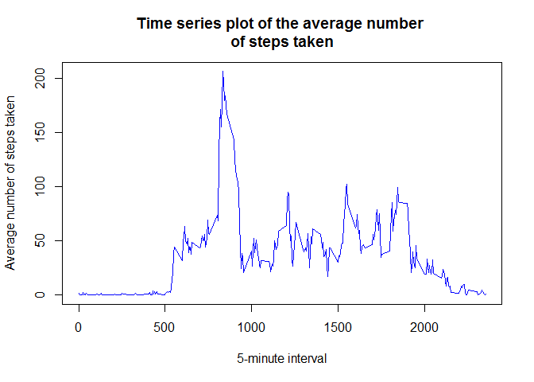

# Reproducible research: Peer Assessment 1
Marion Henry  
October 27, 2017  


## Loading and preprocessing the data

#### 1. Load the data (i.e. read.csv()).

This step assumes that your working directory is the one containing the activity.csv file we will work with. I set it up for my computer:


```r
working_directory <- "~/Coursera/05 Reproducible research/Week 2/Course project 1"
setwd(working_directory)
activity <- read.csv("activity/activity.csv")
```

#### 2. Process/transform the data (if necessary) into a format suitable for your analysis.

The data file already looks to be in a suitable format for the analysis. Below are a few clues about the dataset:


```r
str(activity)
```

```
## 'data.frame':	17568 obs. of  3 variables:
##  $ steps   : int  NA NA NA NA NA NA NA NA NA NA ...
##  $ date    : Factor w/ 61 levels "2012-10-01","2012-10-02",..: 1 1 1 1 1 1 1 1 1 1 ...
##  $ interval: int  0 5 10 15 20 25 30 35 40 45 ...
```

```r
summary(activity)
```

```
##      steps                date          interval     
##  Min.   :  0.00   2012-10-01:  288   Min.   :   0.0  
##  1st Qu.:  0.00   2012-10-02:  288   1st Qu.: 588.8  
##  Median :  0.00   2012-10-03:  288   Median :1177.5  
##  Mean   : 37.38   2012-10-04:  288   Mean   :1177.5  
##  3rd Qu.: 12.00   2012-10-05:  288   3rd Qu.:1766.2  
##  Max.   :806.00   2012-10-06:  288   Max.   :2355.0  
##  NA's   :2304     (Other)   :15840
```

Please note that missing values are coded by "NA". We will do the first calculations without considering them.


## What is mean total number of steps taken per day?

#### 1. Calculate the total number of steps taken per day.

We begin by grouping the data per day using the aggregate() function and then we make a histogram of the total number of steps taken each day:


```r
by_day <- with(activity, 
               aggregate(steps ~ date, 
                         FUN = sum, 
                         na.rm = TRUE
                         )
               )
names(by_day) <- c("date", "sum")
```

#### 2. Make a histogram of the total number of steps taken each day.

We use the hist() function from the base plotting system:


```r
hist(by_day$sum, 
        col = "blue", 
        main = "Histogram of the total number of steps taken each day", 
        xlab = "Number of steps", 
        ylab = "Frequency")
```


#### 3. Calculate and report the mean and median of the total number of steps taken per day.

We use respectively the mean() and median() function to calculate the mean and median of the total number of steps taken per day. We put these two values in the variables step_mean and step_median, respectively:


```r
step_mean <- mean(by_day$sum)
step_mean
```

```
## [1] 10766.19
```

```r
step_median <- median(by_day$sum)
step_median
```

```
## [1] 10765
```

So, the mean of the total number of steps taken each day is about 10766 and its median is 10765.


## What is the average daily activity pattern?

#### 1. Make a time series plot (i.e. type = "l") of the 5-minute interval (x-axis) and the average number of steps taken, averaged across all days (y-axis).

We first group the data per interval accross all days, using again the aggregate function:


```r
by_interval <- with(activity, aggregate(steps ~ interval, FUN = mean, na.rm = TRUE))
names(by_interval) <- c("interval", "mean")
```

We are now able to draw the time series plot:


```r
with(by_interval, plot(interval, mean, 
        type = "l", 
        col = "blue", 
        main = "Time series plot of the average number \nof steps taken", 
        xlab = "5-minute interval", 
        ylab = "Average number of steps taken"))
```



#### 2. Which 5-minute interval, on average across all the days in the dataset, contains the maximum number of steps?

To answer this question, we subset from the by_interval dataset the row where the maximum number of steps appears and then 


```r
step_max <- by_interval[which.max(by_interval$mean),1]
print(step_max)
```

```
## [1] 835
```

So, the 5-minute interval that, on average, contains the maximum number of steps is the 835 one.


## Imputing missing values

Note that there are a number of days/intervals where there are missing values (coded as NA). The presence of missing days may introduce bias into some calculations or summaries of the data.

#### 1. Calculate and report the total number of missing values in the dataset (i.e. the total number of rows with NAs).

We proceed by counting the number of rows of the activity dataset where the variable steps is NA:


```r
number_na <- dim(activity[is.na(activity$steps),])
print(number_na[1])
```

```
## [1] 2304
```

The total number of missing values in the dataset is 2304. Note that it corresponds to what we have already seen when applying the summary function at the begining of the document.

#### 2. Devise a strategy for filling in all of the missing values in the dataset. The strategy does not need to be sophisticated. For example, you could use the mean/median for that day, or the mean for that 5-minute interval, etc...

I choose here to fill in all of the missing values with the mean for the corresponding 5-minute interval accros all days for each missing value. I begin by adding a variable "day_mean" associating to each interval the mean of steps accross all days. Let's do it by merging the tow datasets "activity" and "by_interval" on the interval variable:


```r
merging <- merge(activity, by_interval, by = "interval", all = TRUE)
dim(merging)
```

```
## [1] 17568     4
```

Now, we can replace the variable steps with the mean accross days for each date-interval combination where steps variable is missing:


```r
merging$steps[is.na(merging$steps)] <- merging$mean[is.na(merging$steps)]
```

#### 3. Create a new dataset that is equal to the original dataset but with the missing data filled in.

In order to produce this new dataset, we just have to get rid of the mean variable in the merging dataset. We store the result in a variable called activity_filled and do a sanity check on its dimensions:


```r
activity_filled <- merging[,1:3]
dim(activity_filled)
```

```
## [1] 17568     3
```

#### 4. Make a histogram of the total number of steps taken each day and Calculate and report the mean and median total number of steps taken per day. Do these values differ from the estimates from the first part of the assignment? What is the impact of imputing missing data on the estimates of the total daily number of steps?

Again, we begin by grouping the data per day using the aggregate() function in the activity_filled dataset and then we make a histogram of the total number of steps taken each day:


```r
by_day_filled <- with(activity_filled, aggregate(steps ~ date, FUN = sum, na.rm = TRUE))
names(by_day_filled) <- c("date", "sum")
```

We use the hist() function from the base plotting system:


```r
hist(by_day_filled$sum, 
        col = "green", 
        main = "Histogram of the total number of steps taken each day \nafter missing values are imputed",
        xlab = "Number of steps", 
        ylab = "Frequency")
```


We use respectively the mean() and median() function to calculate the mean and median of the total number of steps taken per day. We put these two values in the variables step_mean_filled and step_median_filled, respectively:


```r
step_mean_filled <- mean(by_day_filled$sum)
step_mean_filled
```

```
## [1] 10766.19
```

```r
step_median_filled <- median(by_day_filled$sum)
step_median_filled
```

```
## [1] 10766.19
```

We see that the rounded mean of the total number of steps taken per day stays 10766 and its median becomes also 10766. These values don't really differ from the estimates from the first part of this assignment. However, we notice in the histogram that imputing missing data increased the frequency of the most popular interval in terms of total number of steps per day. 


## Are there differences in activity patterns between weekdays and weekends?

#### 1. Create a new factor variable in the dataset with two levels - "weekday" and "weekend" indicating whether a given date is a weekday or weekend day.

We first create a function which returns if a given day is a weekday or weekend day with the help of the weekdays() function:


```r
which.dayType <- function(date) {
    day <- weekdays(date)
    if (day %in% c("Monday", "Tuesday", "Wednesday", "Thursday", "Friday")) 
        return("weekday") 
    else if (day %in% c("Saturday", "Sunday")) 
        return("weekend") 
    else stop("date error")}
```

We use this function to add the requested new variable to the activity_filled dataset accordingly:


```r
activity_filled$dayType <- sapply(as.Date(activity_filled$date), which.dayType)
table(activity_filled$dayType)
```

```
## 
## weekday weekend 
##   12960    4608
```

#### 2. Make a panel plot containing a time series plot (i.e. type = "l") of the 5-minute interval (x-axis) and the average number of steps taken, averaged across all weekday days or weekend days (y-axis). See the README file in the GitHub repository to see an example of what this plot should look like using simulated data.

We first compute the average number of step taken by 5-minutes interval accross all weekdays and weekend days separately:


```r
step_avg <- with(activity_filled, 
                 aggregate(steps ~ interval + dayType, 
                           FUN = mean
                           )
                 )
```

We then plot the requested graph with help of the ggplot function from the ggplot2 package:


```r
library(ggplot2)
ggplot(data = step_avg, mapping = aes(interval, steps)) +
    geom_line(col = "purple") +
    facet_grid(dayType ~ .) +
    xlab("5-minute interval") +
    ylab("Average number of steps") +
    ggtitle("Panel plot comparing the average number of steps taken per 5-minute interval \nacross weekdays and weekends") + 
    theme(plot.title = element_text(hjust = 0.5))
```


From this graph, we can conclude that the patterns for weekdays and weekend days are not exactly the same but have a lot of global similarities, like a zero average number of step from interval = 0 to interval = 500, maximum reached around interval 850, peaks at the same places, ...

Thank you for reading! :)


